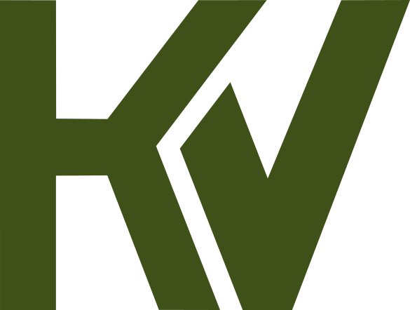

  <picture>
    <source media="(prefers-color-scheme: dark)" srcset="public/markenlogo/logo-weiss.svg">
    
  </picture>

<h1 align="center">kazuvate</h1>

  Handgebaute Frontend-Websites für KMU in der Schweiz. 
  Webdesign aus Basel.

  <a href="https://kazuvate.ch"><strong>kazuvate.ch</strong></a>

---

## Leistungen

- **One-Pager:** eine einzelne Seite mit allem, was zählt. Leistungen, Kontakt und Anfahrt.
- **Mehrseitige Website:** fünf bis acht Unterseiten mit eigener Struktur für Leistungen, Team und Referenzen.
- **Wartung und Textpflege:** Änderungen innert 24 Stunden, dazu Hosting, Sicherungen und ein Auge auf die Ladezeit.

## Die Website

- Von Hand geschrieben, ohne WordPress, Baukasten oder Vorlage.
- Dreisprachig: Deutsch, Englisch und Französisch.
- Referenzen als Bildschirmfoto mit Link auf das laufende Ergebnis.
- Kontaktformular mit Antwort innert 24 Stunden.
- Keine Cookies, kein Tracking, keine Dateien von fremden Servern.

## Lizenz

Alle Rechte vorbehalten, siehe [LICENSE](LICENSE).
